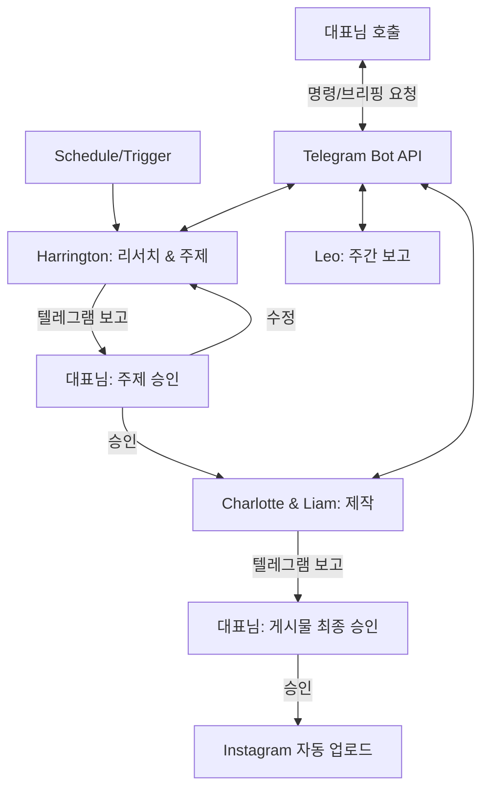

# AI 에이전트 팀(Harrington 팀) 시스템 구현 계획서 (v2)

## 1. 비판적 검토 및 현실성 분석 (Zero-Cost 관점)

사용자께서 제안하신 구조에 대해 **'무자본 자동화'** 관점에서 냉정하게 분석한 결과입니다.

### ⚠️ 위험 요소 및 단호한 지적
- **X, Reddit, 유튜브 리서치 (Harrington):** 
    - **지적:** X는 API가 매우 비싸고, 유튜브와 레딧은 무단 크롤링 시 IP 차단 위험이 큽니다. "무자본"으로는 이들을 직접 긁어오는 것이 가장 큰 병목입니다.
    - **수정:** Gemini 1.5 Pro의 **'Google Search Grounding'** 기능을 활용하여 특정 SNS의 최신 트렌드를 간접적으로 검색하는 방식으로 우회해야 안정적입니다.
- **릴스 생성 (Charlotte):**
    - **지적:** AI 비디오 생성(Runway 등)은 비용이 상당합니다. 100% 자동 영상 제작은 무자본에서 사실상 불가능합니다.
    - **수정:** 정적인 이미지에 배경음악과 자막을 입히는 **'모션 그래픽형 릴스'**나 템플릿 기반 영상을 코드로 생성하는 방식을 채택해야 합니다.

### ✅ 구현 가능성이 높은 부분
- **2단계 승인 플로우:** 텔레그램을 통한 중간 컨펌 구조는 개발 난이도가 낮으면서도 안전성이 매우 높습니다.
- **에이전트 브리핑:** 텔레그램 봇의 챗봇 기능을 통해 각 에이전트의 상태를 묻는 기능(Chat interface)은 충분히 가능합니다.
- **주간 보고서 (Leo):** Gemini API의 무료 할당량 내에서 가장 쉽게 구현 가능한 영역입니다.

---

## 2. 수정한 시스템 아키텍처

## 3. 에이전트 상세 업무 정의 (Roles)

| 이름 | 역할 | 핵심 도구 |
| :--- | :--- | :--- |
| **Harrington** | 검색 및 주제 선정 | Gemini 1.5 Pro (Search), News API |
| **Charlotte** | 비주얼 제작 | Playwright (HTML to Image), Pillow |
| **Liam** | 카피라이팅 | Gemini 1.5 Pro |
| **Leo** | 분석 및 브리핑 | Python Logic, Gemini |

## 4. 구현 단계 (Step-by-Step)

### [1단계] 텔레그램 메신저 및 기본 뼈대 구축
- Harrington부터 Leo까지 각 요원의 '페르소나' 설정 (프롬프트 작성)
- 텔레그램 봇에서 각 에이전트를 호출할 수 있는 명령어(`/harrington_brief` 등) 설계

### [2단계] 리서치 및 1차 승인 파이프라인
- Harrington이 최신 정보를 수집하여 텔레그램으로 전송하는 기능 개발
- 텔레그램 버튼(`[승인]`, `[다시 찾아와]`) 구현

### [3단계] 콘텐츠 생성 및 2차 승인 파이프라인
- 샬롯(디자인)과 리암(글)의 협력 로직 구현
- HTML 기반의 고퀄리티 카드뉴스 렌더링 엔진 구축

### [4단계] 자동 배포 및 주간 보고
- Instagram Graph API 연동 (비즈니스 계정 권한 획득 가이드 포함)
- Leo의 주간 분석 보고서 자동화 및 GitHub Actions 스케줄링

## 5. 최종 검토 제안
대표님, **"무자본"**을 유지하기 위해 릴스는 **"정적 이미지+음악"** 형태의 심플한 영상으로 시작하고, 리서치는 전용 API가 아닌 **AI의 구글 검색 기능**을 활용하는 방향으로 확정해도 될까요?
