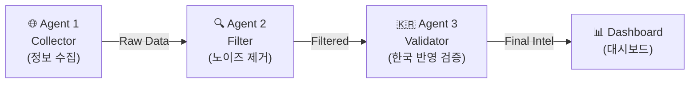

# Global Intelligence Pipeline - AI Agent Team

해외 금융/테크 정보를 실시간 수집 → 노이즈 제거 → 한국 반영 여부 검증하는 3단계 AI 에이전트 파이프라인 + 대시보드 구현 계획입니다.

---

## 정보 소스 선별 및 우선순위

### 🔴 Tier 1 (필수, 무료) — "파이프라인의 생명선"

| 소스 | 수집 방법 | 제공 정보 | 무료 한계 |
| :--- | :--- | :--- | :--- |
| **X (Twitter) API** | API v2 (Free tier) | 월가 핵심 계정들의 실시간 트윗 (SemiAnalysis, Unusual Whales, ZeroHedge 등) | 월 1,500건 읽기, 검색 불가 → **RSS 브릿지로 우회** |
| **Reddit API** | API (Free) | r/wallstreetbets, r/stocks, r/semiconductor 인기 포스트 | 무료, 분당 60회 요청 제한 |
| **RSS 피드** | Python `feedparser` | ZeroHedge, TrendForce, SemiAnalysis(무료 요약), Hacker News 헤드라인 | 전문(Full text)은 유료, 제목+요약만 무료 |
| **Yahoo Finance API** | `yfinance` (비공식) | 종목별 실시간 가격, 거래량, 옵션 데이터 | 무료, 비공식이라 불안정할 수 있음 |

### 🟡 Tier 2 (권장, 무료~저비용) — "차별화의 무기"

| 소스 | 수집 방법 | 제공 정보 | 무료 한계 |
| :--- | :--- | :--- | :--- |
| **Quiver Quantitative** | API (Free tier) | 미 국회의원 매매, 정부 계약, 로비 데이터 | 무료 API 존재, 일부 엔드포인트 제한 |
| **Whale Alert** | API (Free tier) | 대규모 코인 이체 실시간 알림 | 무료: 분당 10회, 역사 데이터 제한 |
| **FRED (미 연준)** | API (Free) | 금리, 실업률, CPI 등 거시경제 지표 | 완전 무료 |
| **SEC EDGAR** | RSS/API (Free) | 13F(헤지펀드 포트폴리오), 8-K(긴급 공시) | 완전 무료 |

### 🟢 Tier 3 (선택, 유료) — "프로급 업그레이드"

| 소스 | 월 비용 | 제공 정보 | 필수 여부 |
| :--- | :--- | :--- | :--- |
| **SemiAnalysis (Substack)** | ~$20/월 | 반도체·AI 인프라 프리미엄 리포트 (포토닉스 등) | ⭐ **강력 권장** (릴스 대본의 핵심 재료) |
| **Unusual Whales 유료** | ~$40/월 | 실시간 옵션 플로우, 다크 풀 데이터 | 선택 (무료 트위터로 대체 가능) |
| **Bloomberg / WSJ** | $25,000+/년 | 기관급 풀 리서치 | ❌ 불필요 (비용 대비 효과 없음) |

> [!IMPORTANT]
> **Bloomberg/WSJ는 불필요합니다.** Tier 1~2 소스만으로도 Barebone AI 수준의 정보력 확보 가능합니다. 유일하게 유료 투자 가치가 있는 것은 **SemiAnalysis (~$20/월)**입니다.

---

## 3단계 AI 에이전트 아키텍처



### Agent 1: Collector (수집 에이전트)
- **역할:** Tier 1~2 소스에서 30분~1시간 간격으로 데이터 수집
- **수집 대상:** 뉴스 헤드라인, 트윗, 종목 거래량 이상치, 13F 공시 등
- **기술:** Python 스크립트 (feedparser, tweepy, requests, yfinance)
- **출력:** JSON 형태의 Raw Intelligence 리스트

### Agent 2: Filter (필터 에이전트)
- **역할:** 수집된 Raw Data에서 노이즈 제거 및 중요도 판별
- **핵심 로직:**
  - GPT-4o mini API로 각 정보의 **"시장 영향도"** 1~10점 채점
  - 7점 이상만 통과 (임계값 조절 가능)
  - 중복 뉴스 제거 (코사인 유사도 기반)
- **출력:** 점수화된 핵심 정보 리스트 (제목, 요약, 관련 종목, 영향도 점수)

### Agent 3: Validator (한국 반영 검증 에이전트)
- **역할:** 필터 통과된 정보가 한국 뉴스에 이미 나왔는지 확인
- **핵심 로직:**
  - 네이버 뉴스 검색 API로 관련 키워드 한국어 뉴스 유무 체크
  - 한국 기사 0건 또는 3건 미만 → `🔥 독점 정보` 태그
  - 한국 기사 다수 발견 → `⚪ 이미 반영됨` 태그
- **출력:** 최종 인텔리전스 리포트 (독점 여부 태그 포함)

---

## 기술 스택 및 구현 방법

### 백엔드 (파이프라인)
- **언어:** Python 3.11+
- **스케줄링:** APScheduler (30분 간격 자동 실행)
- **AI:** OpenAI GPT-4o mini API (필터링 및 요약)
- **DB:** SQLite or Supabase (수집 데이터 저장)
- **구현 담당:** Antigravity + Claude Code

### 프론트엔드 (대시보드)
- **프레임워크:** Next.js (또는 Vanilla HTML/CSS/JS)
- **디자인:** 다크 모드, 실시간 업데이트 (SSE or WebSocket)
- **기능:** 에이전트 상태 모니터링, 정보 카드 타임라인, 독점 정보 하이라이트
- **구현 담당:** Antigravity (프론트엔드 스킬 활용)

---

## 프로젝트 구조

### [NEW] [intelligence_pipeline/](file:///c:/Users/yeedd/.gemini/antigravity/intelligence_pipeline/)
```
intelligence_pipeline/
├── agents/
│   ├── collector.py      # Agent 1: 소스별 수집 로직
│   ├── filter.py          # Agent 2: GPT 기반 노이즈 제거
│   └── validator.py       # Agent 3: 한국 뉴스 체크
├── sources/
│   ├── rss_feeds.py       # RSS 피드 수집기
│   ├── reddit_client.py   # Reddit API 클라이언트
│   ├── twitter_bridge.py  # X(Twitter) RSS 브릿지
│   ├── finance_data.py    # Yahoo Finance 데이터
│   └── sec_edgar.py       # SEC 13F 공시 수집기
├── config.py              # API 키, 소스 URL, 임계값 설정
├── scheduler.py           # APScheduler 기반 자동 실행
├── pipeline.py            # 3단계 파이프라인 오케스트레이터
└── server.py              # FastAPI 서버 (대시보드에 데이터 제공)
```

### [NEW] [intelligence_dashboard/](file:///c:/Users/yeedd/.gemini/antigravity/intelligence_dashboard/)
```
intelligence_dashboard/
├── index.html             # 메인 대시보드 페이지
├── style.css              # 다크 모드 디자인
└── app.js                 # 실시간 데이터 패칭 + UI 렌더링
```

---

## 월 예산 산정

| 항목 | 비용 | 비고 |
| :--- | :--- | :--- |
| GPT-4o mini API | ~₩5,000/월 | 하루 ~100건 분석 기준 (매우 저렴) |
| Reddit API | ₩0 | 무료 |
| RSS 피드 | ₩0 | 무료 |
| Yahoo Finance | ₩0 | 비공식 무료 |
| Quiver Quant API | ₩0 | 무료 티어 |
| SEC EDGAR | ₩0 | 완전 무료 |
| FRED | ₩0 | 완전 무료 |
| 네이버 뉴스 검색 API | ₩0 | 무료 (일 25,000건) |
| **호스팅 (Vercel/로컬)** | ₩0 | 로컬 실행 시 무료 |
| **합계 (최소)** | **~₩5,000/월** | |
| SemiAnalysis (선택) | +₩25,000/월 | 강력 권장하지만 선택 |
| **합계 (권장)** | **~₩30,000/월** | |

> [!TIP]
> Bloomberg 터미널(연 ₩3,500만)의 **0.01% 비용**으로 Barebone AI급 정보 파이프라인을 구축할 수 있습니다.

---

## 구현 역할 분담

| 단계 | 담당 | 설명 |
| :--- | :--- | :--- |
| 소스 수집기 (sources/) | **Antigravity** | RSS, Reddit, Yahoo Finance 등 각 소스별 Python 수집 모듈 작성 |
| AI 에이전트 (agents/) | **Antigravity** | GPT-4o mini 호출 로직, 프롬프트 엔지니어링 |
| 파이프라인 오케스트레이터 | **Antigravity** | 3단계 에이전트 연결 및 스케줄링 |
| 대시보드 UI | **Antigravity** | 다크 모드 대시보드, 프론트엔드 스킬 활용 |
| 배포/인프라 | **사용자** | API 키 등록, 환경변수 세팅 |

---

## Verification Plan

### 자동화 테스트
1. `python pipeline.py --test` 실행하여 각 에이전트가 순서대로 동작하는지 확인
2. 수집된 Raw Data가 JSON 형식으로 정상 출력되는지 검증
3. GPT 필터가 7점 이상/미만을 정확히 분류하는지 샘플 10건으로 검증

### 수동 검증
1. 대시보드(`http://localhost:3000`)를 브라우저에서 열어 실시간 데이터 카드가 표시되는지 확인
2. 🔥 독점 정보 태그가 붙은 항목을 클릭하여 네이버 뉴스 검색 결과와 대조
3. 사용자가 직접 대시보드를 보며 "이 정보가 실제로 유용한가?" 체감 테스트

---

## User Review Required

> [!IMPORTANT]
> **사용자 확인이 필요한 사항:**
> 1. **OpenAI API 키:** GPT-4o mini 사용을 위해 OpenAI API 키가 필요합니다. 보유하고 계신가요?
> 2. **네이버 개발자 API 키:** 한국 뉴스 검색을 위해 네이버 Open API 등록이 필요합니다.
> 3. **Reddit API 키:** Reddit 앱 등록(무료)이 필요합니다.
> 4. **SemiAnalysis 구독 여부:** 월 ~$20 유료 구독을 하실 의향이 있으신가요? (없어도 Tier 1만으로 MVP 가능)
> 5. **호스팅:** 로컬(내 PC)에서만 쓸 건지, 클라우드(Vercel 등)에 올릴 건지?
